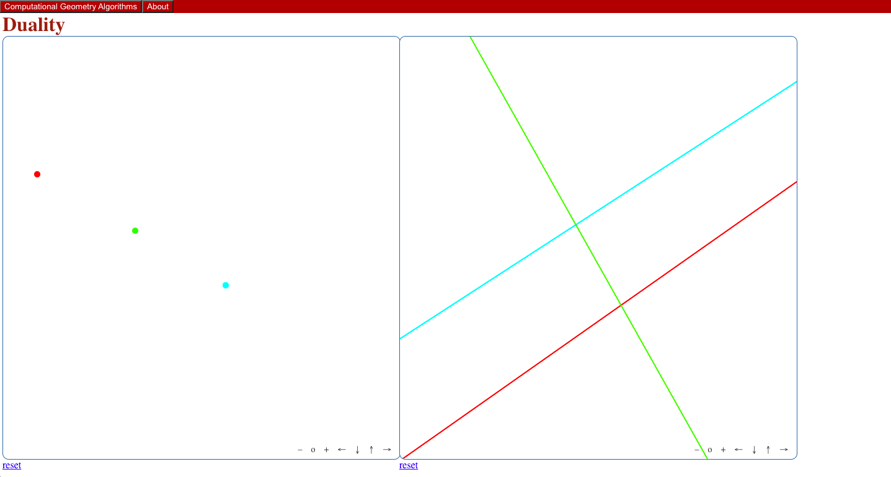

# Point-line Duality

This is an interactive demo of point-line duality, based on the one [here](https://students.engineering.wustl.edu/comp_geo_algorithms/dual_point/dualPoint.html).

## Key Changes
 - Right click on a point to remove it
 - The state of each line is derived directly from it's dual point, so the two never get out of sync.
    - In the original demo, sometimes this could happen. In the image below, the three points are nearly colinear, but two of the dual lines are parallel. 
    
    