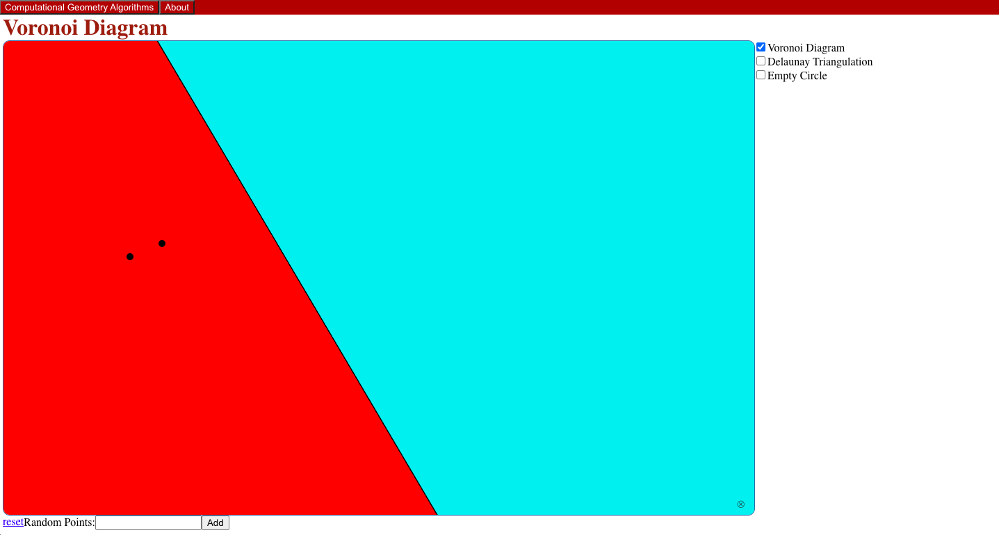

# Voronoi Diagram

This is an interactive demo of Voronoi Diagrams and Delaunay Triangulations, based on the one [here](https://students.engineering.wustl.edu/comp_geo_algorithms/Voronoi_Diagram/VoronoiDiagram.html).

## Key Changes
 - Right click on a point to remove it
 - The bounds of each Voronoi cell are guaranteed to be correct.
    - In the original demo, sometimes one cell could contain two sites, while another cell was completely empty. See the image below for an example:
    
    